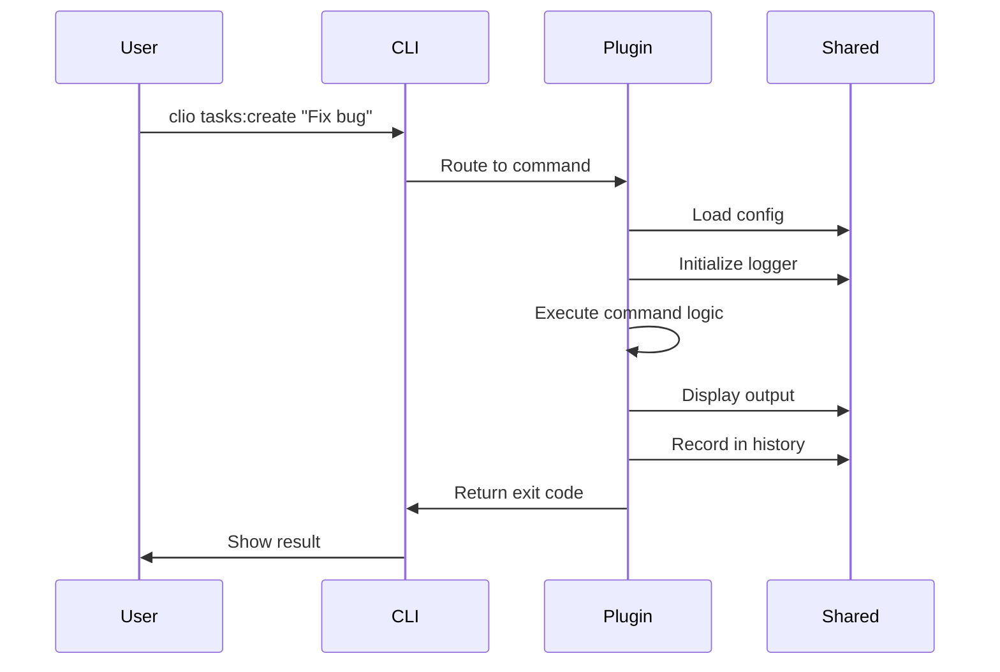

# Architecture Overview

The Clio CLI Operations Platform uses a plugin-first, monorepo architecture designed for scalability, maintainability, and developer experience.

## System Architecture

```
┌─────────────────────────────────────────────────────────────┐
│                     CLI Ops Monorepo                         │
├─────────────────────────────────────────────────────────────┤
│                                                              │
│  ┌──────────┐  ┌──────────┐  ┌──────────┐                 │
│  │  clio    │  │  plugins │  │ examples │   User-Facing   │
│  │  core    │  │ (tasks,  │  │(community│   Layer         │
│  │          │  │  fetch,  │  │ plugins) │                 │
│  └────┬─────┘  │  repo)   │  └──────────┘                 │
│       │        └────┬─────┘                                 │
│       └─────────────┴─────────────┘                         │
│                     │                                        │
│  ┌──────────────────┴──────────────────┐                   │
│  │      Shared Packages Layer          │                   │
│  ├─────────────────────────────────────┤                   │
│  │ • shared-commands (BaseCommand)     │  Core             │
│  │ • shared-config   (ConfigManager)   │  Infrastructure   │
│  │ • shared-logger   (Logger)          │                   │
│  │ • shared-plugins  (Plugin system)   │                   │
│  ├─────────────────────────────────────┤                   │
│  │ • shared-ui       (Spinners, etc.)  │  User             │
│  │ • shared-prompts  (Interactions)    │  Experience       │
│  │ • shared-formatter (Output)         │                   │
│  ├─────────────────────────────────────┤                   │
│  │ • shared-history  (Command history) │  Advanced         │
│  │ • shared-ipc      (Cross-plugin)    │  Features         │
│  │ • shared-hooks    (Lifecycle)       │                   │
│  │ • shared-services (Business logic)  │                   │
│  ├─────────────────────────────────────┤                   │
│  │ • shared-types    (TypeScript)      │  Development      │
│  │ • shared-testing  (Test utilities)  │  Support          │
│  │ • shared-exit-codes (Error codes)   │                   │
│  └─────────────────────────────────────┘                   │
│                                                              │
│  ┌─────────────────────────────────────┐                   │
│  │      Build & Development Tools      │                   │
│  ├─────────────────────────────────────┤                   │
│  │ • Turborepo  (Build orchestration)  │                   │
│  │ • Changesets (Versioning)           │                   │
│  │ • TypeScript (Type checking)        │                   │
│  │ • Vitest     (Testing)              │                   │
│  └─────────────────────────────────────┘                   │
└─────────────────────────────────────────────────────────────┘
```

## Core Principles

### 1. Plugin-First Architecture

Clio is designed as a plugin manager where all functionality is distributed through plugins:

- **Core CLI**: Minimal core focused on plugin management
- **Official Plugins**: Maintained plugins for common tasks (tasks, fetch, repo)
- **Community Plugins**: Third-party extensions following the same architecture

### 2. Shared Package Ecosystem

Common functionality is extracted into reusable packages:

```typescript
// Every command extends BaseCommand
import { BaseCommand } from '@cli-ops/shared-commands'

export default class MyCommand extends BaseCommand {
  protected async execute(): Promise<void> {
    // Automatic access to logger, history, config, etc.
    this.logger.info('Hello world')
  }
}
```

### 3. Type-Safe Development

Full TypeScript with strict mode enabled:

- No implicit `any`
- Strict null checks
- No unchecked indexed access
- Strong typing throughout

### 4. Monorepo Benefits

Using pnpm workspaces + Turborepo:

- **Shared dependencies**: Single node_modules for common deps
- **Parallel builds**: Fast, cached builds across packages
- **Atomic changes**: Update multiple packages in one PR
- **Code sharing**: Import shared packages with `workspace:*`

## Package Categories

### Core Infrastructure

**@cli-ops/shared-commands**  
Base command class with lifecycle hooks, logging, history integration.

**@cli-ops/shared-config**  
Configuration management with validation and persistence.

**@cli-ops/shared-logger**  
Structured logging with multiple levels and transports.

**@cli-ops/shared-plugins**  
Plugin system base classes and utilities.

### User Experience

**@cli-ops/shared-ui**  
Spinners, progress bars, color-coded output.

**@cli-ops/shared-prompts**  
Interactive confirmations, selections, and input.

**@cli-ops/shared-formatter**  
Structured output formatting (tables, JSON, YAML).

### Advanced Features

**@cli-ops/shared-history**  
Command tracking with history management.

**@cli-ops/shared-ipc**  
Inter-process communication for plugin coordination.

**@cli-ops/shared-hooks**  
Lifecycle hooks for extensibility.

**@cli-ops/shared-services**  
Business logic, caching, retry, and data services.

## Command Execution Flow



1. **Parse**: oclif parses command and flags
2. **Route**: Direct to appropriate plugin command
3. **Initialize**: BaseCommand loads config, logger, history
4. **Execute**: Command-specific logic runs
5. **Output**: Format and display results
6. **Record**: Save to history for undo/replay
7. **Exit**: Return status code

## Technology Stack

| Layer               | Technology                    |
| ------------------- | ----------------------------- |
| **Language**        | TypeScript 5.7+ (strict mode) |
| **Package Manager** | pnpm 9+ with workspaces       |
| **Build System**    | Turborepo 2.7+                |
| **CLI Framework**   | oclif v4                      |
| **Testing**         | Vitest                        |
| **Versioning**      | Changesets                    |
| **Linting**         | ESLint + Prettier             |

## Design Philosophy

### ADHD/OCD-Friendly

- **Clear Feedback**: Every action provides immediate feedback
- **Undo Support**: Command history with undo capabilities
- **Progress Indicators**: Visual feedback for long operations
- **Confirmation Prompts**: Prevent accidental destructive actions
- **Consistent Patterns**: Predictable command structure

### Performance-First

- **Fast Startup**: Under 100ms for simple commands
- **Caching**: Aggressive caching of expensive operations
- **Lazy Loading**: Load dependencies only when needed
- **Parallel Execution**: Concurrent operations where possible

### Developer Experience

- **Type Safety**: Catch errors at compile time
- **Hot Reload**: Fast development iteration
- **Clear Errors**: Actionable error messages
- **Comprehensive Docs**: Documentation for all APIs

## Next Steps

- [Plugin Development](/docs/plugins/development)
- [Core Concepts](/docs/concepts/overview)
- [Contributing Guide](/docs/contributing/getting-started)
